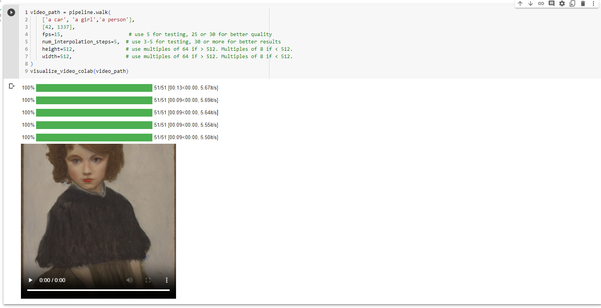

# stable_diffusion_model_text2video

<div align="center">
<h3>
    Video Diffusion WebUI: Text2Video + Image2Video + Video2Video WebUI
</h3>
</div>

This repo is a Text2Video + Image2Video + Video2Video WebUI Implementation.
### Installation
```bash
pip install video-diffusion
```


- 🚀 Diffusion model result
- <p align="center">
    
</p>

- <p align="center">
    
</p>

